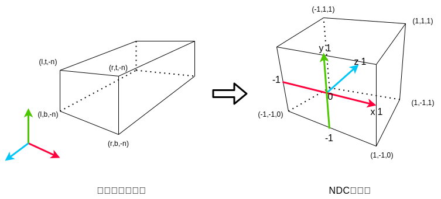

### MVP 矩阵

MVP 矩阵分别是模型（Model），观察（View），投影（Projection）三个矩阵

- 1.MVP 首先从局部空间（Local Space）经过 M 矩阵（Model MATRTX）的变换到我们的世界空间（Word Space）。
- 2.然后世界空间（Word Space）再经过 V 矩阵（VIEW MATRTX）的变换，变换到我们的观察空间（View Space）。
- 3.观察空间（View Space）经过投影矩阵（PROJECTION MATRIX）的变换，变换到裁剪空间（Clip Space）。
- 4.裁剪空间（Clip Space）通过投影映射变换到屏幕空间（Screen Coordinate）

<div align="center">

<hr/>

平移矩阵 T

$$
\left[
\begin{matrix}
1 & 0 & 0 & Tx  \\
0 & 1 & 0 & Ty  \\
0 & 0 & 1 & Tz  \\
0 & 0 & 0 & 1
\end{matrix}
\right]
*
\left[
\begin{matrix}
x  \\
y  \\
z  \\
1
\end{matrix}
\right]
$$

缩放矩阵 S

$$
\left[
\begin{matrix}
Sx & 0 & 0 & 0  \\
0 & Sy & 0 & 0  \\
0 & 0 & Sz & 0  \\
0 & 0 & 0 & 1
\end{matrix}
\right]
*
\left[
\begin{matrix}
x  \\
y  \\
z  \\
1
\end{matrix}
\right]
$$

旋转矩阵 R

$$
\left[
\begin{matrix}
cosγ & -sinγ & 0 & 0  \\
sinγ & cosγ & 0 & 0  \\
0 & 0 & 1 & 0  \\
0 & 0 & 0 & 1
\end{matrix}
\right]
*
\left[
\begin{matrix}
x  \\
y  \\
z  \\
1
\end{matrix}
\right]
\tag{绕z轴旋转}
$$

$$
\left[
\begin{matrix}
1 & 0 & 0 & 0  \\
0 & cosα & -sinα & 0  \\
0 & sinα & cosα & 0  \\
0 & 0 & 0 & 1
\end{matrix}
\right]
*
\left[
\begin{matrix}
x  \\
y  \\
z  \\
1
\end{matrix}
\right]
\tag{绕x轴旋转}
$$

$$
\left[
\begin{matrix}
cosβ & 0 & sinβ & 0  \\
0 & 1 & 0 & 0  \\
-sinβ & 0 & cosβ & 0  \\
0 & 0 & 0 & 1
\end{matrix}
\right]
*
\left[
\begin{matrix}
x  \\
y  \\
z  \\
1
\end{matrix}
\right]
\tag{绕z轴旋转}
$$

模型矩阵 M = S \* R \* T \* M （ 平移 -> 旋转 -> 缩放 ）

</div>

<hr/>

### GPUBufferUsage 标志

GPUBufferUsage 标志决定了 GPUBuffer 在创建后如何使用：

| 标志          | 描述                                                 | 示例                                                                                                   |
| ------------- | ---------------------------------------------------- | ------------------------------------------------------------------------------------------------------ |
| MAP_READ      | 可以映射缓冲区以供读取。只能与 COPY_DST 结合使用。   | 使用 GPUMapMode.READ 调用 mapAsync()                                                                   |
| MAP_WRITE     | 可以映射缓冲区以进行写入。只能与 COPY_DST 结合使用。 | 使用 GPUMapMode.WRITE 调用 mapAsync()                                                                  |
| COPY_SRC      | 缓冲区可以用作复制操作的源。                         | 作为 copyBufferToBuffer() 或 copyBufferToTexture() 调用的 source 参数。                                |
| COPY_DST      | 缓冲区可用作复制或写入操作的目标。                   | 作为 copyBufferToBuffer() 或 copyTextureToBuffer() 调用的“目标”参数，或作为 writeBuffer() 调用的目标。 |
| INDEX         | 该缓冲区可用作索引缓冲区。                           | 传递给 setIndexBuffer()。                                                                              |
| VERTEX        | 该缓冲区可用作顶点缓冲区。                           | 传递给 setVertexBuffer()。                                                                             |
| UNIFORM       | 该缓冲区可以用作统一缓冲区。                         | 作为 GPUBufferBindingLayout 的绑定组条目，其 buffer.type 为 "uniform"。                                |
| STORAGE       | 缓冲区可以用作存储缓冲区。                           | 作为具有 buffer 的 GPUBufferBindingLayout 的绑定组条目。type 为 "storage" 或 "read- 仅存储"            |
| INDIRECT      | 缓冲区可用于存储间接命令参数。                       | 作为 drawIndirect() 或 dispatchWorkgroupsIndirect() 调用的 indirectBuffer 参数。                       |
| QUERY_RESOLVE | 缓冲区可用于捕获查询结果。                           | 作为 resolveQuerySet() 调用的“目标”参数。                                                              |

<h3 align="center">

<hr/>

💡 **正交投影** 💡

</h3>



> **注意:** webgpu 中 z 轴为[0,1]，不同于 opengl 中 z 轴为[-1,1]。

构建正交投影矩阵相对于透视投影来说要简单很多，只需要将视图空间（eye space）的坐标线性的映射到 NDC（normalized device coordinates）坐标中：

$$
(X_e) \to (X_n) \in [-1,1]
$$

$$
(Y_e) \to (Y_n) \in [-1,1]
$$

$$
(Z_e) \to (Z_n) \in [0,1]
$$

有以下线性变换等式：

$$
X_n = k_1 \times X_e + b_1   （经过(l,-1),(r,1)两点）
$$

$$
Y_n = k_2 \times Y_e + b_2   （经过(b,-1),(t,1)两点）
$$

$$
Z_n = k_3 \times Z_e + b_3   （经过(-n,0),(-f,1)两点）
$$

其中：

l：视锥体左平面，r：视锥体右平面

b：视锥体下平面，t：视锥体上平面

n：视锥体近平面，f：视锥体远平面

解得:

$$
k_1 = \frac{2}{r-l}
$$

$$
b_1 = \frac{r+l}{l-r}
$$

$$
k_2 = \frac{2}{t-b}
$$

$$
b_2 = \frac{t+b}{b-t}
$$

$$
k_3 = \frac{1}{n-f}
$$

$$
b_3 = \frac{n}{n-f}
$$

对应的正交投影矩阵就是：

$$
\begin{bmatrix}
\frac{2}{r-l} & 0 & 0 & \frac{r+l}{l-r} \\
0 & \frac{2}{t-b} & 0 & \frac{t+b}{b-t} \\
0 & 0 & \frac{1}{n-f} & \frac{n}{n-f} \\
0 & 0 & 0 & 1
\end{bmatrix}
$$

对应的代码：

```
function ortho(left: number, right: number, bottom: number, top: number, near: number, far: number): Float32Array {
  dst = new Float32Array(16);

  dst[0]  = 2 / (right - left);
  dst[1]  = 0;
  dst[2]  = 0;
  dst[3]  = 0;

  dst[4]  = 0;
  dst[5]  = 2 / (top - bottom);
  dst[6]  = 0;
  dst[7]  = 0;

  dst[8]  = 0;
  dst[9]  = 0;
  dst[10] = 1 / (near - far);
  dst[11] = 0;

  dst[12] = (right + left) / (left - right);
  dst[13] = (top + bottom) / (bottom - top);
  dst[14] = near / (near - far);
  dst[15] = 1;

  return dst;
}

```
